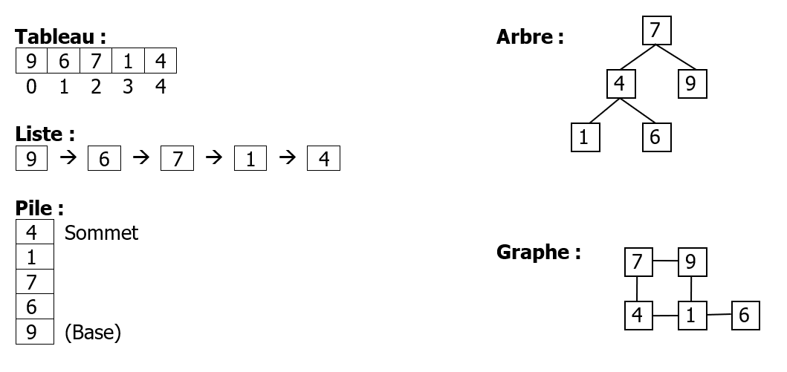

# Abstrait / Concret
Pour ne pas refaire tout le travail lorsque l'on change de language de programmation par exemple, on sépare notre projet en une **solution abstraite** et une **solution concrète**

Ce qui permet d'avoir une solution indépendante de **l'implémentation** (machine, langage, types, ...)

Une structure de donnée bien choisie permettra d'utiliser un algorithme plus efficace

## Solution abstraite
Elle utilise les notions de:
- **Algorithme (traitement)**
- **Type abstrait de données (informations)**

## Solution concrète
On implémente un **programme (traitement)** qui utilise des **types concrets de données (informations)**

## En résumé
|   | **Données** | **Traitements** |  
| - | ----------- | --------------- |
| **Abstrait** | Type abstrait de données | Algorithme |  
| **Concret** | Structure concrète de données | Programme |   
| *Exemple* | *Variable* | *Fonctions* | 

# Abstract Data Type (Type abstrait de données)
Un "TAD" est la définition d'un **type de données** avec les **opérations** que l'on peut faire sur ce type

## Spécification algébrique d'un TAD
On donne les spécification suivante du type:

- **La sorte**  
  Le nom du type abstrait

- **La description**  
  Description (courte) du TAD

- **La signature**  
  L'ensemble des opérations possibles sur le type  
  On donne le nom et le "profil" des opérations (qui deviendront des fonctions ou méthodes)

- **Les axiomes**  
  Règles qui garantissent la cohérence des informations  
  (Souvent exprimées sous formes de relations entre opérations)

> Le terme "abstrait" veut dire que le TAD n'est pas dépendant des implémentations possibles

## Représentation en mémoire
Un TAD linéaire peut être représenté de deux façons en mémoire
- **Positions contigües**  
  Tableau

- **Eléments liés**  
  Liste chaînées

## Exemple: Pile d'entiers

### Sorte
**Pile**  
Utilise entier et booléen

### Description
Une pile est une structure linéaire qui ne permet que d'accéder au dernier élément ajouté

### Signature
- **créer**  
  (&rarr; pile)
  ```ts
  function creer(): Pile;
  ```

- **estVide**  
  (pile &rarr; booléen)
  ```ts
  function estVide(pile: Pile): bool;
  ```
  
- **empiler**  
  (pile, entier &rarr; pile)
  ```ts
  function empiler(pile: Pile, entier: Int): Pile;
  ```
  
- **dépiler**  
  (pile &rarr; pile, entier)  
  *Précondition: dépiler(p) est définie ssi estVide(p) est faux*
  ```ts
  function depiler(pile: Pile): [Pile, Int];
  ```

### Axiomes
`dépiler(empiler(p,i)) = (p, i)`  
`estVide(créer())` est VRAI  
`estVide(empiler(p, i))` est FAUX

## Opérations d'un TAD
Il y'a 4 classes d'opération avec un TAD
- **Création et destruction d'une structure** 
  
- **Séléction, modification, insertion ou suppression**  
  (Accesseur et modificateurs)

- **Traitement de tous les composants**  
  (Parcours)

- **Opérations spécifiques à la structure**

Pour une définition complète des opérations on précise pour chacune d'entre-elles

- **Pré-conditions**  
  Conditions qui doivent être remplies par les données fournies à cette opération
  
- **Post-conditions**  
  Conditions qui doivent être remplies par le résultat de cette opération
  
- **Commentaires et assertions**  
  Explication et commentaires du fonctionnement de l'algorithme de cette opération

# Concrete Data Structure (Structure Concrète de Données, SCD)
La **structure de données concrète** désigne la façon dont est implémenté un type de dans un langage de programmation

Dans un langage de programmation on construit une structure en utilisant les types fournis par le langage

Il y'a 2 catégories de types

## Les types primitifs (simple, atomique)
Contient une unique information  
Pointeurs, entier, réels, caractères, etc...

## Les types composés (agrégats, structures)
Contient plusieurs informations atomiques  
Tableaux, structures, classes, etc...

Ils peuvent être

- **Homogènes**  
  Les informations sont toutes du même type (primitif ou composé)  
  Exemple: Tableaux


- **Hétérogènes**  
  Les informations sont de différents types  
  Exemple: Enregistrements

## Les structures de données

| **Type**  | **Accès** | **Exemples** |  
| --------- | --------- | ------------ |
| **Linéaires** | Direct | Enregistrements, Tableaux, Vecteurs |  
| **Linéaires** | Séquentiel | Piles, Files, Listes |   
| **Non linéaire** | - | Arbres, Graphes, Ensembles (sets), Dictionnaires (maps) | 

### Que signifie accès "direct" / "séquentiel"
**Direct**  
Tous les éléments peuvent être accédés dans n'importe quel ordre  
On accède **directement** à un élément  
(tableau)

**Séquentiel**  
Les éléments doivent être accédés dans un certain ordre  
Pour accéder à un élément on parcours la structure de donnée  
(pile, liste chaînée)

### Que signifie "linéaire"
Une structure de données linéaire contient un unique premier et dernier élément.
Ceci s'applique pour tous les éléments, ils ont tous un succésseur et prédécesseur



## Le choix d'un type
Le choix d'un type se repose sur l'utilisation qu'on doit en faire
- Algorithme à appliquer sur ces données
- Mode d'accès à un élément spécifique (direct ou séquentiel)
- Capacité de s'étendre dynamiquement


# Les types abstraits de données linéaires

## Stack (Pile)
- TAD **linéaire**
- Accès **séquentiel**
- **LIFO** (Last In, First Out)

Adapté pour des situations ou l’accès à un élément implique d’avoir d’abord traité tous les éléments plus récemment ajoutés

### Application
- Appels de fonctions
- Evaluation d'expression (parsing)
- Sauvegarde des états (fonction annuler dans les application graphiques)

### Signature minimale
`push` (empiler)  
`pop` (dépiler)  
`isEmpty` (estVide)


## Queue (File)
- TAD **linéaire**
- Accès **séquentiel**
- **FIFO** (First In, First Out)

Adapté pour des situations ou l’accès à un élément présuppose d’avoir accéder à tous les éléments ajoutés avant lui (buffers, priorités)

### Application
- Traitement ordonnés
- Système d'exploitation
- Réseaux
- Simulation (personnes, transports)

### Signature minimale
`enqueue` (ajouter)  
`dequeue` (retirer)  
`isEmpty` (estVide)

### Variantes

#### File de priorité
Chaque élément est muni d'une priorité déterminant quel élément retirer

#### deque (Double Ended QUEe)
Les opération peuvent se faire aux 2 extrémités de la file


## List (Liste)
- TAD **linéaire**
- Accès **séquentiel**
- Le **premier** élément se nomme **tête**
- Le **dernier** élément se nomme **queue**
- Une des structures de données les plus utilisées  

Le fait qu'on peut accéder à l'élément suivant un autre avec `next` introduit le concept de **liste chaînée**

### Signature minimale
`add` (ajouter)  
`remove` (retirer)  
`first` (premier)  
`next` (successeur)  
`isEmpty` (estVide)

### Variantes

#### Liste doublement chaînée
Si on avait une méthode `previous` on aurait une liste **doublement chaînée**  

#### Liste circulaire
Si on définit que l'élément suivant le dernier (la queue) est le premier (`first`) on a une **liste circulaire**


## Vector (Vecteurs)
- TAD **linéaire**
- Accès **direct**
- On **accède à un élément avec son index dans la liste**
- Pas limité à une taille, **ce sont pas des tableaux simples**
- Connu sous le nom de tableaux dynamiques

### Fonctionnalités
Ils permettent plus de choses qu'un tableau simple tel que
- Taille
- Premier
- Dernier
- ...
