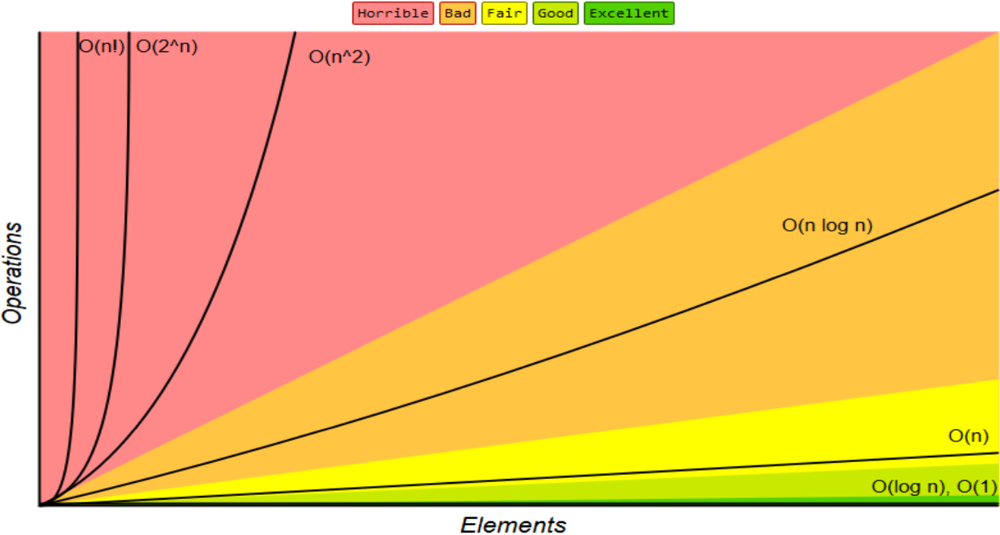
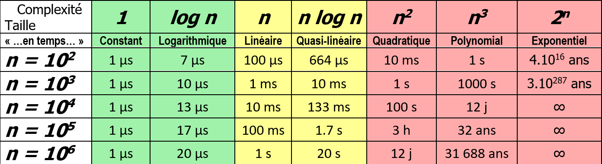
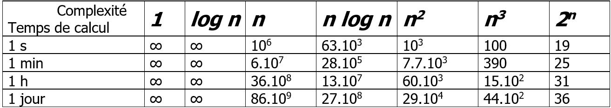
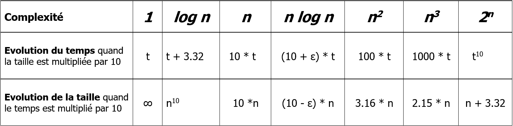

# Qu'est-ce qu'un algorithme
- Décrit un **traitement** sur un nombre fini de **données**

- Est une composition fini d'étapes qui sont eux-même formée d'un nombre finis d'opérations dont chacune est **définie** et **effective**

- Doit toujours pouvoir se terminer après un nombre **fini** d'opérations et fournir un **résultat**

- Executé avec les **même données** doit toujours donner le **même résultat**

- Est **indépendant** d'un langage de programmation
  
- Est **implémenté** dans un langage de programmation

## Opération définie
Une opération doit être définit de façon rigoureuse et non ambiguës

## Opération effective
Pouvant être fait dans un temps fini (réalisable par une machine)

Une division avec un nombre **fini** de décimal est une **opération effective**

Une division avec un nombre **infini** de décimales n'est **pas une opération effective**

# Complexité d'un algorithme
Le but est de déterminer:
- **Le temps d'éxecution**
- **La place mémoire**

Afin de comparer différent algorithme qui résolvent le même problème entre eux

## Quelle mesure utiliser
On peut exprimer la complexité en **temps** ou **nombre de cycles machine**

### Temps
Nombre d'opération effectuées par la programme et le temps nécessaire pour chaque opérations

### Nombre de cycles machine
- Le nombre d'instructions et le nombre de données du programme  
- Le nombre de "mots" nécessaires pour stocker chacune des instructions
- Le nombre de "mots" mémoire pour la manipulation des données

> 1 "mot" = 2 octets = 16 bits

## Composantes influent sur la mesure de la complexité
- L'algorithme
- Le programme
- L'ordinateur
- Les données

Ce qui donnes des énoncé comme:  

**L'algorithme A** implémenté par le **programme P** sur **l'ordinateur O** et executé sur les **données D** utilise **_k secondes_** et **_j bits de mémoire_**

## But de la complexité
Cependant on voudrait connaître la complexité d'un algorithme indépendamment de ces composantes

Ce qui donnerait une énoncé comme:

Sur **toutes machines** pour **n'importe quel le langage de programmation**, **l'algorithme A1** est meilleur que **l'algorithme A2** pour les **données de "grande taille"**

# Mesure de la complexité en temps
Une solution est constituée d'opérations fondamentales et le temps d'exécution d'un algorithme est donc toujours proportionnel au nombre de ces opérations

Si on a plusieurs opérations fondamentales, on les comptent séparément et on leur affecte éventuellement un poids qui tient compte des temps d'exécution différents

Ces opérations fondamentales peuvent êtres:

- Pour le recherche d'un élément dans une liste en RAM  
  **Le nombre de comparaisons entre cet élément et les éléments de la liste**

- Pour la recherche d'un élément sur un disque  
  **Le nombre d'accès à la mémoire ROM**

- Pour multiplier deux matrices  
  **Le nombre de multiplications / additions**

- Pour trier une liste d'éléments  
  1. **Le nombre de comparaisons entre deux éléments**
  2. **Le nombre de déplacement d'éléments**

> Souvent un algorithme plus rapide utilise plus de place  
> 
> Il faut éviter d'utiliser un algorithme utilisant trop de ROM, car ceci est beaucoup plus lent


# Comparaison de deux algorithmes
En général, la complexité d'un algorithme est **fonction de la taille des données**

On détermine alors la rapidité de croissance de cette fonction lorsque la taille des données croît

## Exemple 1
Pour 3 algorithmes avec faisant `A1(n)`, `A2(n)` et `A3(n)` opérations

`A1(n) = n + C`  
`A2(n) = 2n`  
`A3(n) = n^2`

On sait que `A1` est mieux que `A2` qui est mieux que `A3`

> `A2` est mieux que `A3` dès que `n >= 2`

## Exemple 2
Pour 2 algorithmes avec faisant `A1(n)` et `A2(n)` opérations

`A1(n) = 3(n^2)`  
`A2(n) = 25n`  

On sait que `A2` est mieux que `A1` dès que `n > 8`

## Exemple 3
Pour 2 algorithmes avec faisant `A1(n)` et `A2(n)` opérations

`A1(n) = a(n^2)`  
`A2(n) = bn`  

On sait que `A2` est mieux que `A1`  
Car `f(n) = n^2` croît plus vite que `g(n) = n`

On dit que l'**ordre de grandeur asymptotique** de `f(n)` est strictement plus grand que celui de `g(n)`

> On dit aussi que "`f` domine `g` quand `n` temps vers l'infini"

## Calculer la complexité
```cpp
int x = 5;
int polynom[3] = {4, 1, 5}
int res = 0;

// 4x^0 + 1x^1 + 5x^2
// x: 5, result: 134
for (int i = 0; i < 3; i++)
{
  int resPow = pow(x, i);
  res += polynom[i] * resPow;
}
```
On définit l'opération fondamentale: **multiplication**

En **déroulant** l'algorithme on a en nombre d'opérations fondamentales:  

1. `int resPow = pow(x, i);` `(x^0 = 1)` &rarr; 0  
   `res += polynom[i] * resPow` `(4 * 1 = 4)` &rarr; 1   
   Total &rarr; 1

2. `int resPow = pow(x, i);` `(x = x)` &rarr; 0  
   `res += polynom[i] * resPow` `(1 * 5 = 4)` &rarr; 1   
   Total &rarr; 1 

3. `int resPow = pow(x, i);` `(x * x = x)` &rarr; 1  
   `res += polynom[i] * resPow` `(5 * 5 = 4)` &rarr; 1   
   Total &rarr; 2 

Continuons hors de l'execution...
   
4. `int resPow = pow(x, i);` `(x * x * x = x)` &rarr; 2  
   `res += polynom[i] * resPow` &rarr; 1   
   Total &rarr; 3

5. `int resPow = pow(x, i);` `(x * x * x * x = x)` &rarr; 3  
   `res += polynom[i] * resPow` &rarr; 1   
   Total &rarr; 4

6. `int resPow = pow(x, i);` `(x * x * x * x * x = x)` &rarr; 4  
   `res += polynom[i] * resPow` &rarr; 1   
   Total &rarr; 5 

7. ...

Sommons tous ça
`n` est le degré du polynome (taille du tableau - 1)

`(0 + 1) + (0 + 1) + (1 + 1) + (2 + 1) + (3 + 1) + (4 + 1) + ... + n`  
`1 + 1 + 2 + 3 + 4 + 5 + ... + n`

On voit qu'on a une suite arithmétique, utilisons la formule de sommation

`O(n) = (n + 1)(0 + n) / 2 + 1 = n(n + 1) / 2 + 1`

> `+ 1` car on a un `1` avant le début de la suite

En simplifié:

`O(n) = n^2`

## Ordres de grandeurs asymptotiques



## Tableaux
Voici un tableau montrant les différentes informations sur les fonctions de complexité

### Temps d'execution
Temps d'éxecution de ces algorithmes pour différente taille de données n   



> Sur un ordinateur pouvant effectuer 10^6 opérations par seconde

### Taille maximale des données
La taille maximale des données que l'on peut traiter par chacun des algorithmes pour un certain temps



### Evolution de la taille des données et du temps d'éxecution
Montre comment la taille des données et le temps d'éxecution varient en fonction de l'un l'autre



### Conclusion

#### Algorithme en temps polynomial
Les algorithme en temps polynomial (`n^k, k > 0`) sont vraiment utilisable que pour `k < 2`  
Lorsque `2 <= k <= 3`, on peut régler des problème de taille moyenne  
Lorsque `k > 3`, on peut régler des petits problèmes


#### Algorithme en temps exponentiel
Les algorithme en temps exponentiel `2^n` sont pas vraiment utilisable, que pour les problèmes de petites tailles

# Quelques algorithmes avec leur complexité

| Notation grand O | Nom | "Rapidité" | Exemple |
| ---------------- | --- | ---------- | ----------- |
| `O(1)` | Constant | Rapide | Nombre pair ou impair |
| `O(log n)` | Logarithmique | Rapide | Trouver un élément dans un tableau trié avec du "Binary search" |
| `O(n)` | Linéaire | Rapide | Trouver le plus grand élément dans un tableau (non trié) |
| `O(n log n)` | Quasi-linéaire (Linearithmic) | Rapide | Trier un tableau avec "Merge sort" |
| `O(n^2)` | Quadratique | Moyenne | Trier un tableau avec "Bubble sort" |
| `O(n^3)` | Cubique | Moyenne | Résolution de système à 3 inconnues |
| `O(2^n)` | Exponentielle | Lente | Trouver tous les sous-ensembles |
| `O(n!)` | Factorielle | Lente | Trouver toutes les permutations d'un ensemble |

##  Nombre pair ou impair
`O(1)`  
Complexité constante

```js
function isEvenOrOdd(n) {
  return n % 2 ? 'Odd' : 'Even';
}
```

##  Binary search
`O(log n)`  
Complexité logarithmique

```js
function indexOf(array, element, offset = 0) {
  const half = parseInt(array.length / 2);
  const current = array[half];

  if(current === element) {
    return offset + half;
  } else if(element > current) {
    const right = array.slice(half);
    return indexOf(right, element, offset + half);
  } else {
    const left = array.slice(0, half)
    return indexOf(left, element, offset);
  }
}
```

## Nombre max dans un tableau non trié
`O(n)`  
Complexité linéaire

```js
function findMax(n) {
  let max;
  let counter = 0;

  for (let i = 0; i < n.length; i++) {
    counter++;
    if(max === undefined || max < n[i]) {
      max = n[i];
    }
  }

  return max;
}
```

## Merge sort
`O(n log n)`  
Complexité quasi-linéaire (linearithmic)

```js
/**
 * Sort array in asc order using merge-sort
 * @example
 *    sort([3, 2, 1]) => [1, 2, 3]
 *    sort([3]) => [3]
 *    sort([3, 2]) => [2, 3]
 * @param {array} array
 */
function sort(array = []) {
  const size = array.length;
  // base case
  if (size < 2) {
    return array;
  }
  if (size === 2) {
    return array[0] > array[1] ? [array[1], array[0]] : array;
  }
  // slit and merge
  const mid = parseInt(size / 2, 10);
  return merge(sort(array.slice(0, mid)), sort(array.slice(mid)));
}

/**
 * Merge two arrays in asc order
 * @example
 *    merge([2,5,9], [1,6,7]) => [1, 2, 5, 6, 7, 9]
 * @param {array} array1
 * @param {array} array2
 * @returns {array} merged arrays in asc order
 */
function merge(array1 = [], array2 = []) {
  const merged = [];
  let array1Index = 0;
  let array2Index = 0;

  // merge elements on a and b in asc order. Run-time O(a + b)
  while (array1Index < array1.length || array2Index < array2.length) {
    if (array1Index >= array1.length || array1[array1Index] > array2[array2Index]) {
      merged.push(array2[array2Index]);
      array2Index += 1;
    } else {
      merged.push(array1[array1Index]);
      array1Index += 1;
    }
  }
  return merged;
}
```

## Bubble sort
`O(n^2)`  
Complexité quadratique

```js
function sort(n) {
  for (let outer = 0; outer < n.length; outer++) {
    let outerElement = n[outer];

    for (let inner = outer + 1; inner < n.length; inner++) {
      let innerElement = n[inner];

      if(outerElement > innerElement) {
        // swap
        n[outer] = innerElement;
        n[inner] = outerElement;
        // update references
        outerElement = n[outer];
        innerElement = n[inner];
      }
    }
  }
  return n;
}
```

## Résolution système à 3 inconnues
`O(n^2)`  
Complexité quadratique

```js
function findXYZ(n) {
  const solutions = [];

  for(let x = 0; x < n; x++) {
    for(let y = 0; y < n; y++) {
      for(let z = 0; z < n; z++) {
        if( 3*x + 9*y + 8*z === 79 ) {
          solutions.push({x, y, z});
        }
      }
    }
  }

  return solutions;
}
```

## Trouver tous les sous-ensembles
`O(2^n)`  
Complexité exponentielle

```js
function powerset(n = '') {
  const array = Array.from(n);
  const base = [''];

  const results = array.reduce((previous, element) => {
    const previousPlusElement = previous.map(el => {
      return `${el}${element}`;
    });
    return previous.concat(previousPlusElement);
  }, base);

  return results;
}
```

## Trouver tous les sous-ensembles
`O(n!)`  
Complexité factorielle

```js
function getPermutations(string, prefix = '') {
  if(string.length <= 1) {
    return [prefix + string];
  }

  return Array.from(string).reduce((result, char, index) => {
    const reminder = string.slice(0, index) + string.slice(index+1);
    result = result.concat(getPermutations(reminder, prefix + char));
    return result;
  }, []);
}
```

> [Source](https://adrianmejia.com/most-popular-algorithms-time-complexity-every-programmer-should-know-free-online-tutorial-course/)