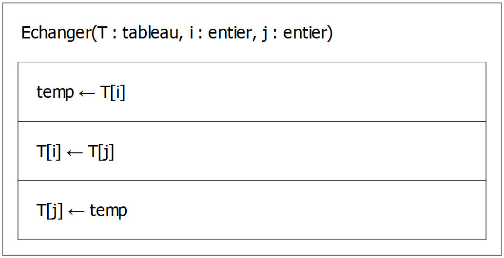
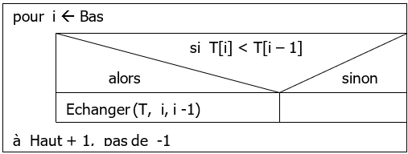
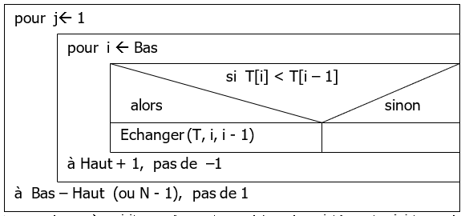
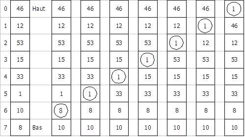
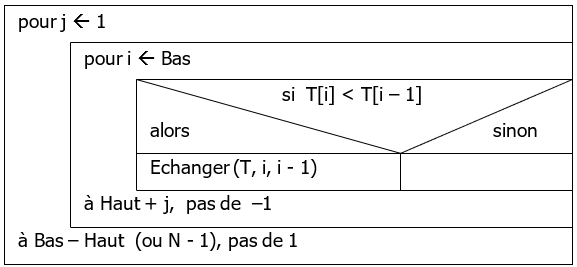
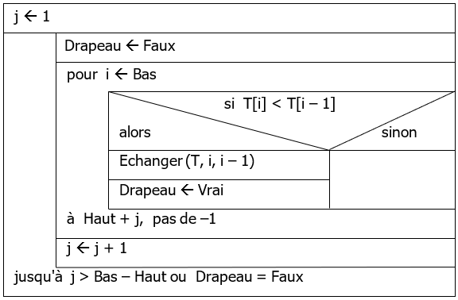

# Les algorithme de tris
Il y'a deux classes d'algorithme de tri
- Les algorithmes de **tri interne**
- Les algorithmes de **tri externe**

## Le tri interne (internal sort)
Il s'effectue **dans la RAM**, souvent dans un tableau contenant les informations à trier

## Le tri externe (external sort)
Il s'effectue **dans la ROM** par l'intermédiaire de fichiers

## Algorithme de tri "en place"
Un algorithme de tri "**en place**" va trier un tableau en le transformant directement, sans en allouer un nouveau qui serait vide et qu'on remplirait avec les données triées

# Tableau
Les indices vont de **Gauche (G)** à **Droite (D)**

Chaque élément est appelé **valeur**

La partie de l'information utilisé pour le tri est la **clé**

> En C, Gauche vaut 0 et Droite vaut la taille du tableau moins 1

# Echanger
Pour trier les informations on doit savoir échanger le contenu de deux cases avec leurs indices `i` et `j`

# Bubblesort (tri bulle)

On compare les clés de deux élément consécutifs à partir du début jusqu'à la fin du tableau

> Ou depuis la fin jusqu'au début du du tableau

## Structogramme

`Parcours(T: Tableau, Haut: int, Bas: int)`  
  
Ceci est uniquement un parcours qui compare deux clés, il faut faire ceci pour tout le tableau

`BubbleSort(T: Tableau, Haut: int, Bas: int)`  
  
Il fait le `Parcours` de 1 à N - 1 fois  
(au final l'opération est faite N - 2 fois)

> j &larr; 1 car on compare les éléments i et i - 1

## Complexité
Au pire des cas la complexité est `O(n^2)`

## Exemple
Ce schéma montre l'évolution du tableau, à gauche le tableau n'est pas trié

On voir que l'élément avec une clé la plus petite (1)remonte dans le tableau jusqu'à atteindre la première place

`Parcours(T, 0, 7)`  

## Améliorations

### Bubble Sort Itératif

`BubbleSortIteratif(T: tableau, Haut: int, Bas: int)`

Le nombre d'échange devient:  
`(N - 1) + (N - 2) + ... + 2 + 1 = N(N - 1) / 2`  
Donc la complexité est quadratique `O(n^2)`

### Bubble Sort Drapeau

`BubbleSortDrapeau(T: tableau, Haut: int, Bas: int)`

Le nombre d'échange reste `N(N - 1) / 2` mais la complexité à augmenté (donc la duré d'exécution aussi)

Cette méthode est adapté pour les tableaux presque complètement triés

## Stabilité
Soient deux éléments du tableau, ayant la même clé, et d’indices i et j avec i < j

Tout élément de clé strictement **inférieure** se placera **au-dessus** d’eux et tout élément de clé strictement **supérieure** se placera **au-dessous** d’eux

Ils se trouveront donc dans les cases d’indice **k** et **k + 1**

**Lors de la comparaison des clés de ces deux éléments, ils ne sont pas échangés**

Donc leur ordre de départ est respecté car **i** se trouve à l'indice **k** et **j** à **k + 1**

La méthode est alors stable

## Analyse
Le nombre de comparaisons dans les méthodes de tri par échange d’éléments consécutifs est :  
`C = n(n - 1) / 2`

Le nombre minimum de déplacements  
`Dmin = 0`

Le nombre moyen de déplacements  
`Dmoy = 3n(n - 1) / 4`

Le nombre maximum de déplacements  
`Dmax = 3n(n - 1) / 2` 

> Un échange continent 3 déplacement (3 affectations), ce qui explique le facteur 3 dans le nombre d'opération effectuées
