# Les algorithme de tris
Il y'a deux classes d'algorithme de tri
- Les algorithmes de **tri interne**
- Les algorithmes de **tri externe**

## Le tri interne (internal sort)
Il s'effectue **dans la RAM**, souvent dans un tableau contenant les informations à trier

## Le tri externe (external sort)
Il s'effectue **dans la ROM** par l'intermédiaire de fichiers

## Algorithme de tri "en place"
Un algorithme de tri "**en place**" va trier un tableau en le transformant directement, sans en allouer un nouveau qui serait vide et qu'on remplirait avec les données triées

# Tableau
Les indices vont de **Gauche (G)** à **Droite (D)**

Chaque élément est appelé **valeur**

La partie de l'information utilisé pour le tri est la **clé**

> En C, Gauche vaut 0 et Droite vaut la taille du tableau moins 1

# Echanger
Pour trier les informations on doit savoir échanger le contenu de deux cases avec leurs indices `i` et `j`

# Bubblesort (tri bulle)

On compare les clés de deux élément consécutifs à partir du début jusqu'à la fin du tableau

> Ou depuis la fin jusqu'au début du du tableau

## Structogramme

`Parcours(T: Tableau, Haut: Entier, Bas: Entier)`  
  
Ceci est uniquement un parcours qui compare deux clés, il faut faire ceci pour tout le tableau

`BubbleSort(T: Tableau, Haut: Entier, Bas: Entier)`  
  
Il fait le `Parcours` de 1 à N - 1 fois  
(au final l'opération est faite N - 2 fois)

> j &larr; 1 car on compare les éléments i et i - 1

## Complexité
Au pire des cas la complexité est `O(n^2)`

## Exemple
Ce schéma montre l'évolution du tableau, à gauche le tableau n'est pas trié

On voir que l'élément avec une clé la plus petite (1)remonte dans le tableau jusqu'à atteindre la première place

`Parcours(T, 0, 7)`  

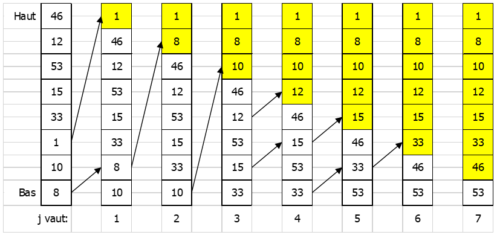

> Haut = 0, Bas = 7

## Améliorations

### Bubble Sort Itératif
Après j parcours, nous avons définitivement placé les j plus petites clés.  
On a donc plus besoin de se soucier de ces éléments, on peut alors commencer notre parcours à `Haut + j` (`0 + j`)

---

`BubbleSortIteratif(T: tableau, Haut: Entier, Bas: Entier)`

Le nombre d'échange devient:  
`(N - 1) + (N - 2) + ... + 2 + 1 = N(N - 1) / 2`  
Donc la complexité est quadratique `O(n^2)`

### Bubble Sort Drapeau
Un tableau peut être trié avant la fin de la boucle (car plus d'un élément peut remonter lors d'un seul parcours), il est alors judicieux de stopper la boucle si le tableau est entièrement trié

On utilise la notion de "drapeau" qui permet de déterminer si le tableau est déjà trié

Le "drapeau" est baissé au début du parcours du tableau et on le lève lors d'un échange

**Si aucun échange à été fait lors d'un parcours cela signifie qu'on a terminé le tri &rarr; Drapeau à Faux**

On test alors l'état du drapeau avant de reparcourir le tableau

---

`BubbleSortDrapeau(T: tableau, Haut: Entier, Bas: Entier)`  

Le nombre d'échange reste `N(N - 1) / 2` mais la complexité à augmenté (donc la duré d'exécution aussi)

Cette méthode est adapté pour les tableaux presque complètement triés

## Stabilité
**On sait qu'un algorithme de tri est stable s'il n'échange pas la position de 2 valeurs égales**

---

Soient deux éléments du tableau, ayant la même clé, et d’indices i et j avec i < j

Tout élément de clé strictement **inférieure** se placera **au-dessus** d’eux et tout élément de clé strictement **supérieure** se placera **au-dessous** d’eux

Ils se trouveront donc dans les cases d’indice **k** et **k + 1**

**Lors de la comparaison des clés de ces deux éléments, ils ne sont pas échangés**

Donc leur ordre de départ est respecté car **i** se trouve à l'indice **k** et **j** à **k + 1**

La méthode est alors stable

## Analyse
Le nombre de comparaisons dans les méthodes de tri par échange d’éléments consécutifs est :  
`C = n(n - 1) / 2`

Le nombre minimum de déplacements  
`Dmin = 0`

Le nombre moyen de déplacements  
`Dmoy = 3n(n - 1) / 4`

Le nombre maximum de déplacements  
`Dmax = 3n(n - 1) / 2` 

> Un échange continent 3 déplacement (3 affectations), ce qui explique le facteur 3 dans le nombre d'opération effectuées

## Visualisation du Bubble Sort
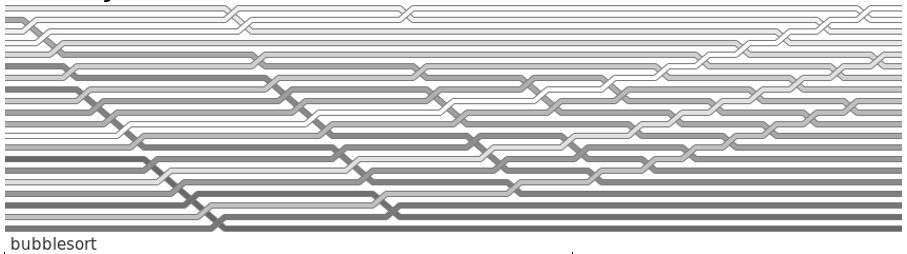

> [Source](https://corte.si/posts/code/visualisingsorting/)

# Tri par extraction (ou tri par séléction)

## Première étape: extraction
La première étape consiste à extraire l’élément ayant la plus petite clé et à l’échanger avec l’élément de **Gauche** du tableau

Pour trouver la plus petite clé le tableau est parcouru de **Gauche** à **Droite**, on garde en mémoire l'indice de la plus petite clé rencontrée

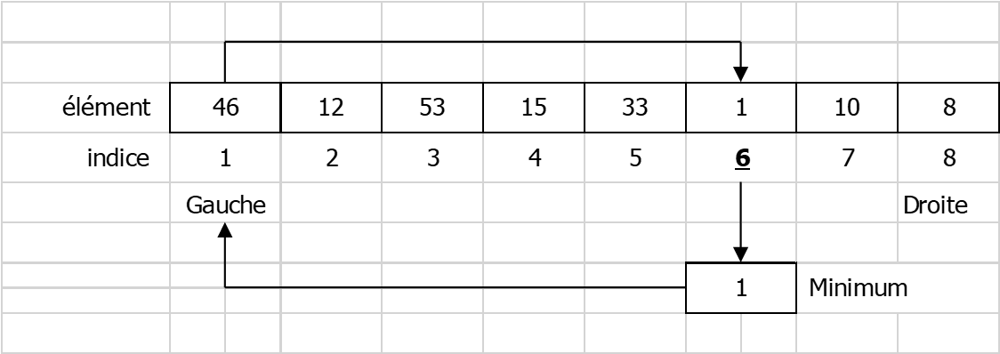

### Structogramme

`PlacerLeMinimumÀGauche(T: tableau, Gauche: Entier, Droite: Entier)`
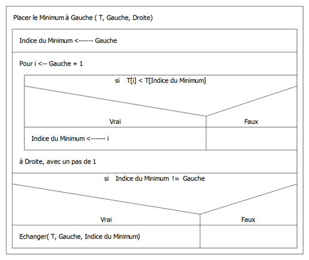

## Deuxième étape: entièreté du tableau
On applique ceci pour tout le tableau, pour cela il faut que qu'on opère uniquement sur la partie du tableau qui n'est pas encore trié:  

1. De **Gauche + 0** à **Droite**
2. De **Gauche + 1** à **Droite**
3. De **Gauche + 2** à **Droite**
4. ...
5. De **Droite - 1** à **Droite**

**Gauche + C** est la partie déjà trié du tableau

> Lorsque les N − 1 éléments ayant les clés les plus petites sont à leur place, le dernier élément qui a la plus grande clé est aussi à sa place

### Structogramme

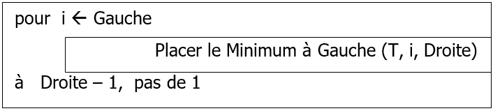

## Complexité
`PlacerLeMinimumAGauche` est executé `N - 1` fois pour un tableau de N éléments, à chaque execution l'algorithme effectue `Droite - Gauche + 1` comparaisons, le nombre de comparaison est donc
  
`C = ((N - 1) + 1) + ((N - 2) + 1) + ... + (3 + 1) + (2 + 1) + (1 + 1)`  
`C = N(N + 1) / 2 - 1`

> 1. `Droite = N` `Gauche = 1`  
> 2. `Droite = N` `Gauche = 2`  
> 3. `Droite = N` `Gauche = 3`  
> 4. ...
> 5. `Droite = N` `Gauche = N - 3`
> 5. `Droite = N` `Gauche = N - 2`
> 5. `Droite = N` `Gauche = N - 1`

Si les clés sont triées, le nombre de déplacement est **au minimum**  
`Dmin = 0`

Dans le pire des cas (chaque itération provoque un échange)  
`Dmax = 3(N - 1)`

## Stabilité
Voici un tableau avec deux clés identiques:

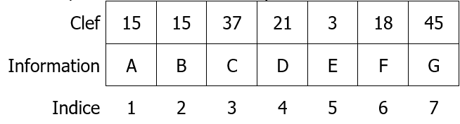

En extrayant le premier minimum ça donne:

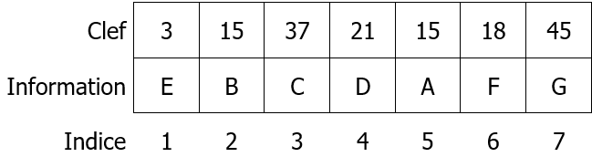

**On voit que l'algorithme n'est pas stable**, car B (15) peut venir après A (15) 

# Tri par insertion
On insère un élément du tableau qui n’est pas encore à sa place dans une partie déjà ordonnée, puis à recommencer avec les éléments suivants

La première étape montre comment insérer un élément dans la partie déjà triée

Dans cet exemple, les éléments `Gauche` à `i - 1` sont déjà ordonnés, on veut insérer l'élément `i`

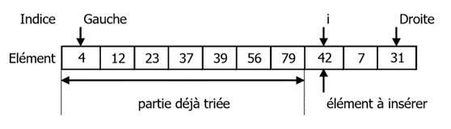

Pour insérer l’élément d’indice `i` dans la partie du tableau trié, il faut le sauvegarder puis décaler vers la droite tous les éléments dont la clé est supérieure à l’élément à insérer

Du coup l’emplacement de l’élément à insérer est trouvé et une case libre est préparée à l'emplacement

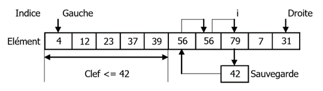

## Insertion élément d'indice i

### Structogramme
`Insertion Elément d'Indice i (T: Tableau, Gauche: Entier, i: Entier)`
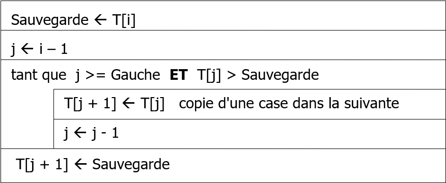

## Tri Insertion itératif
Pour trier complètement le tableau on insère ses éléments en commençant par le deuxième élément (indice `Gauche + 1`) et en terminant par le dernier élément du tableau (indice `Droite`)

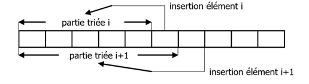

### Structogramme
`Tri Insertion itératif (T: Tableau, Gauche: Entier, Droite: Entier)`
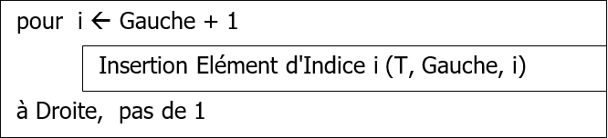

## Complexité
**Au maximum**, le nombre de comparaisons pour l'insertion du i pme élément est (si à l'origine la clé à insérer est plus grande que toutes les autres):  
`i - 1`

**Au minimum**, le nombre de comparaisons est de:  
`1`

**En moxenne**, le nombre de comparaisons est de (en supposant que toutes les permutations de n clés soient équiprobables):  
`i / 2`

Le nombre total de comparaisons et le nombre total de de déplacements sont:

`Cmin = n - 1`  
`Cmoy = (n^2 + n - 2) / 4`   
`Cmax = n(n - 1) / 2`  

`Dmin = 2(n - 1)`  
`Dmoy = (n^2 + 7n - 8) / 4`  
`Dmax = (n^2 + 3n - 4) / 2`  

## Stabilité
Soit deux éléments du tableau, ayant la même clef, et d’indices `i` et `j` avec `i < j`

Puisque on parcours le tableau de `Gauche + 1` à `Droite`, l'élément à l'indice `i` sera inséré en premier dans la partie trié à l'indice `i'`

Quand l'élément à l'indice `j` doit être inséré il sera mis à l'indice `i' + 1` (car on utilise une comparaison stricte des éléments `t[i'] > t[j] == false`)

L'élément à l'indice `i` se trouve donc avant `j`, l'ordre est gardé

**L'algorithme est stable**
