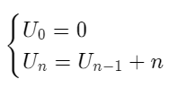

# La récursivité
En programmation, ce concept peut s’appliquer aux structures de données et aux algorithmes:

- Structures de données récursives : listes, arbres et graphes.

- Algorithmes récursifs: un algorithme est dit récursif, si l’une de ses opérations est un appel à une autre instance de ce même algorithme (même opérations, mais avec des données différentes).
  En résumé si l'algorithme s'appel lui-même, il est récursif.

Notre appel récursif doit forcément figurer après une condition, sinon l’algorithme ne s’arrêterait jamais. Cette condition, nommée condition terminale, doit impérativement être remplie à un moment donné pour garantir l’exécution de l’algorithme dans un temps fini.

## Structure de donnée récursive
```ts
class Node {
  nodes: Node[];
}
```

## Algorithme récursif
```ts
/**
* Node1
* ├── Node2
* ├── Node3
* │   └── Node4
* ├── Node5
* │   ├── Node6
* │   ├── Node7
* │   └── Node8
* │       └── Node9
* └── Node10
**/

function find_node(node: Node) {
  // ...

  // If this condition do not exist our algorithme will never stop
  if (node.nodes.length <= 0) return;
  
  find_node(node.nodes);
}

input_node = new Node(/* ... */);
find_node(input_node);
```

```ts
int somme(int n) {
 if (n<=0) return 0;
 else return n + somme(n-1);
}
```

# Récursivité et récurrence
La démonstration par récurrence et un algorithme récursif sont assez similaire. Les 2 points importants jouent un rôle similaire

- Le point d’ancrage et la condition terminale servent à garantir que le résultat est connu ou vérifié pour un cas trivial. Sans eux, une preuve par récurrence ne serait pas fondée et un algorithme récursif ne se terminerait jamais.

- Le passage d’un rang au rang suivant (ou précédent) permet d’étendre le domaine de validité d’une relation (pour une preuve par induction) ou de reporter le problème à un cas plus simple (pour un algorithme récursif).

Si on cherche à calculer la somme des premiers entiers, on peut dire : “Calculer la somme des n premiers entiers est facile, si je connais cette somme pour n-1 : il suffit d’y ajouter n”. Il suffit ensuite de reproduire cette démarche jusqu’à arriver au cas trivial : la somme des 0 premiers entiers est nulle.

### Définition récursive


### Preuve par récurrence
Point d’ancrage  
Passage de n-1 à n

### Algorithme récursif
```
SOMME(n):  
  SI n<=0  
      somme ← 0  
  SINON
      somme ← n + SOMME(n-1)
```

### Fonction récursive
```cpp
int sum(int n) {
 if (n<=0) return 0;
 else return n + sum(n-1);
}
```