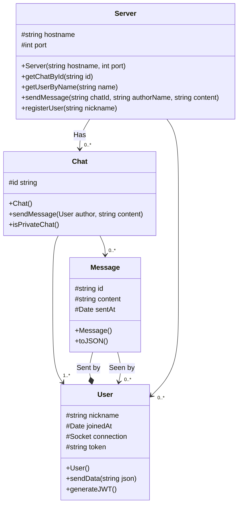

# Schéma UML des classes

Ici on a comme exemple un schéma de classe pour une application de chat

```mermaid
classDiagram

Chat --> "1..*" User
Chat --> "0..*" Message

Message --* User: Sent by
Message --> "0..*" User: Seen by

Server --> "0..*" Chat: Has
Server --> "0..*" User

class Server {
  #string hostname
  #int port

  +Server(string hostname, int port)
  +getChatById(string id)
  +getUserByName(string name)
  +sendMessage(string chatId, string authorName, string content)
  +registerUser(string nickname)
}

class Message {
  #string id
  #string content
  #Date sentAt

  +Message()
  +toJSON()
}

class Chat {
  #id string

  +Chat()
  +sendMessage(User author, string content)
  +isPrivateChat()
}

class User {
  #string nickname
  #Date joinedAt
  #Socket connection
  #string token

  +User()
  +sendData(string json)
  +generateJWT()
}
```

