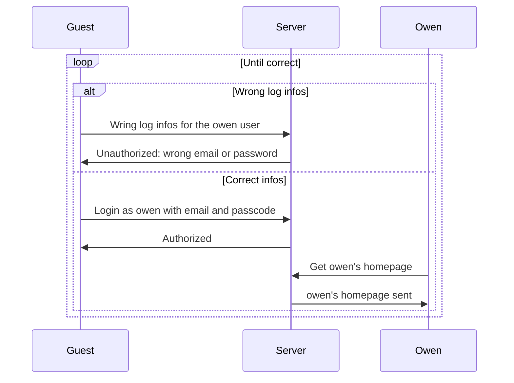
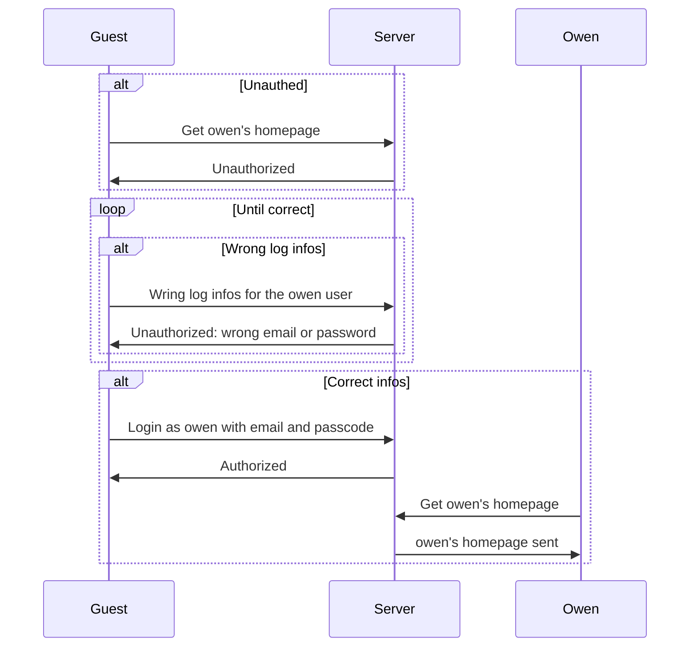
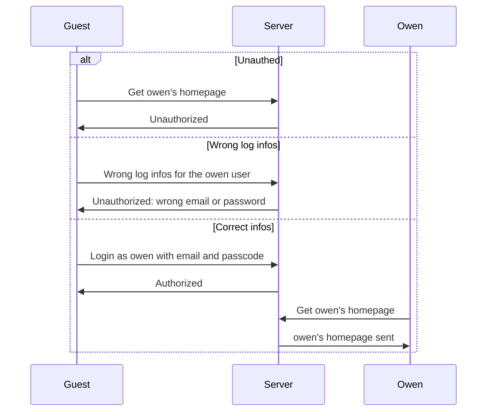

# Diagramme avec plusieurs participants

# Attention
Ces deux diagrammes se lisent de façon bien différente, dans le premier diagramme l'utilisateur fait dans l'ordre:
1. Demande la page de owen et reçoit systématiquement une erreur
2. Se trompe à chaque fois qu'il se connecte
3. Arrive à se connecter

Alors que dans le deuxième **l'utilisateur fait soit le cas 1, le cas 2 ou le cas 3**.

> Les diagrammes suivants n'ont pas de sens, c'est juste pour savoir comment les lire

